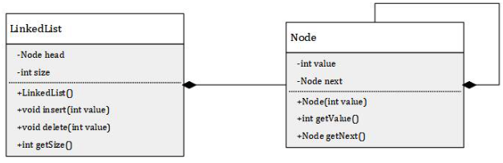

# Question 1

Suppose you are developing a similar (if not identical) project for a company. One teammate poses the following:

> "We do not have to worry about logging. The application is very small and tests should take care of any potential
> bugs. If we really need it, we can print some important data and just comment it out later."

Do you agree or disagree with the proposition? Please elaborate on your reason to agree or disagree. (~50-100 words)

___

**Answer**:
We disagree with the given proposition as loggings are a crucial part in catching issues in a code. Usually tests
can't take in consideration every edge case that might be essential in resolving errors in the code. Also using the
loggings a user can be tracked, like what and when he did something, and it is essential when we talk about security.
It can be also be use for troubleshooting as loggings dive into the behaviour of the program as well. Consequently,
even in a small application, neglecting logging is unwise, as it reveals aspects missed by testing alone.
___

# Question 2

Suppose you have the following `LinkedList` implementation:



How could you modify the `LinkedList` class so that the value could be any different data type? Preferably, provide the
code of the modified class in the answer.
___

**Answer**:

```java
public class LinkedList<T> {
    private Node<T> head;
    private int size;

    public LinkedList() {
        this.head = null;
        this.size = 0;
    }

    public void insert(T data) {
        Node<T> newNode = new Node<>(data);
        if (head == null) {
            head = newNode;
        } else {
            Node<T> current = head;
            while (current.next != null) {
                current = current.next;
            }
            current.next = newNode;
        }
        size++;
    }

    public boolean delete(T value) {
        if (head == null) {
            return false;
        }

        if (head.data.equals(value)) {
            head = head.next;
            size--;
            return true;
        }

        Node<T> current = head;
        while (current.next != null) {
            if (current.next.data.equals(value)) {
                current.next = current.next.next;
                size--;
                return true;
            }
            current = current.next;
        }

        return false;
    }

    public int size() {
        return size;
    }
}
```

___

# Question 3

How is Continuous Integration applied to (or enforced on) your assignment? (~30-100 words)

___

**Answer**:
Following each project update, we applied our pre-defined tests, as they gave more benefits in developing and
maintaining the code quality. This not only protected us from unexpected flaws arising from new features or
modified code but also prevented the occurrence of new errors. Furthermore, this approach facilitated our debugging
process by identifying the specific test case responsible for any failures.
___

# Question 4

One of your colleagues wrote the following class:

```java
import java.util.*;

public class MyMenu {

    private Map<Integer, PlayerAction> actions;

    public MyMenu() {
        actions = new HashMap<>();
        actions.put(0, DoNothingAction());
        actions.put(1, LookAroundAction());
        actions.put(2, FightAction());
    }

    public void printMenuOptions(boolean isInCombat) {
        List<String> menuOptions = new ArrayList<>();
        menuOptions.add("What do you want to?");
        menuOptions.add("\t0) Do nothing");
        menuOptions.add("\t1) Look around");
        if (isInCombat) {
            menuOptions.add("\t2) Fight!");
        }
        menuOptions.forEach(System.out::println);
    }

    public void doOption() {
        int option = getNumber();
        if (actions.containsKey(option)) {
            actions.get(option).execute();
        }
    }

    public int getNumber() {
        Scanner scanner = new Scanner(System.in);
        return scanner.nextInt();
    }
}
```

List at least 2 things that you would improve, how it relates to test-driven development and why you would improve these
things. Provide the improved code below.

___

**Answer**:

1)
Input handling:
The current issue with the `getNumber` method is its reliance on the assumption that users will always input
valid integers, potentially causing runtime errors when this assumption is not met. To enhance the program's robustness
, it is crucial to implement error handling and input validation mechanisms that can handle
invalid inputs.

2)
Takeout Scanner initialization inside the `getNumber`:
The current issue was that the another scanner was initialized every time
when function `getNumber` was called. So now the Scanner is initialized
alongside with all the class only once and used, not initialize for every call.
At the end, there will pe a method which will close the scanner in order to not
have leaks.

Improved code:

```java

import java.util.*;

public class MyMenu {

    private Map<Integer, PlayerAction> actions;
    private Scanner scanner = new Scanner(System.in);

    public MyMenu() {
        actions = new HashMap<>();
        actions.put(0, DoNothingAction());
        actions.put(1, LookAroundAction());
        actions.put(2, FightAction());
    }

    public void printMenuOptions(boolean isInCombat) {
        List<String> menuOptions = new ArrayList<>();
        menuOptions.add("What do you want to?");
        menuOptions.add("\t0) Do nothing");
        menuOptions.add("\t1) Look around");
        if (isInCombat) {
            menuOptions.add("\t2) Fight!");
        }
        menuOptions.forEach(System.out::println);
    }

    public void doOption() {
        int option = getNumber();
        if (actions.containsKey(option)) {
            actions.get(option).execute();
        }
    }

    public int getNumber() {
        int option;
        boolean validInput;

        do {
            try {
                option = scanner.nextInt();
                validInput = true;
            } catch (InputMismatchException e) {
                System.out.println("Invalid input. Please enter a valid number.");
                scanner.next();
                validInput = false;
            }
        } while (!validInput);

        return option;
    }
    
    public void closeScanner() {
        scanner.close();
    }
}
```

___